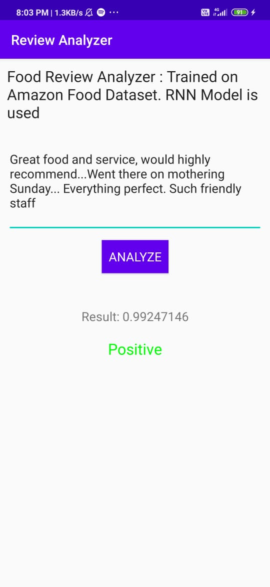

# Sentiment-Analysis-of-Food-Reviews

Built and trained RNN model on Amazon food review dataset. Model was trained on around 3 lakh reviews and tested on 1 lakh reviews.

- Training Accuracy = ~93 %
- Testing Accuracy = ~91 %

tf.Keras model was converted into tflite model. Then, it was used inside Android Application to perform the food review classification inside app.

 

## Screenshots of application - 

| 1. Positive Review                        | 2. Negative Review                          |
|-------------------------------------------|---------------------------------------------|
||  |

